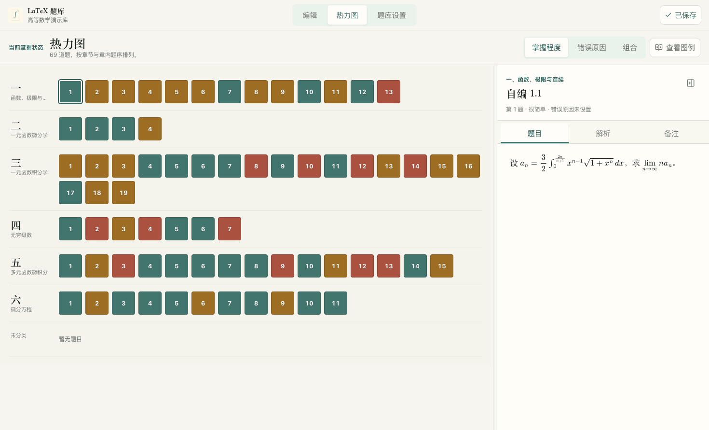
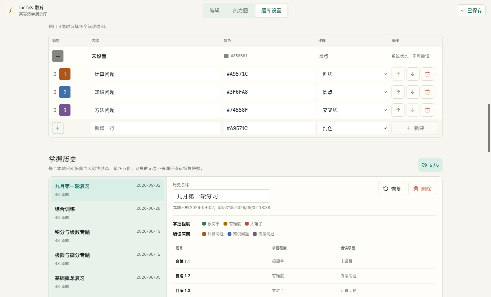

<p align="center">
  
</p>

<h1 align="center">LaTeX 题库</h1>

<p align="center">
  在本地编写、整理、检查并导出 LaTeX 题目。
</p>

<p align="center">
  <a href="README.en.md">English</a>
  ·
  <a href="https://github.com/zyvwang/latex-question-bank/releases">下载预览版</a>
</p>

<p align="center">
  <a href="https://github.com/zyvwang/latex-question-bank/actions/workflows/ci.yml"></a>
  <a href="https://github.com/zyvwang/latex-question-bank/releases"></a>
  <a href="LICENSE"></a>
</p>


LaTeX 题库是一款本地优先的桌面应用。每道题分为题目、解析和备注三个模块，你可以边写边预览公式，用本机 XeLaTeX 检查内容，并将选中的题目整理成 PDF。

题目、图片和导出文件始终保存在你选择的普通文件夹中。应用不要求账户，也不会把题库上传到远端服务。

## 功能

- 使用独立的题目、解析和备注模块编写 LaTeX。
- 调整代码与预览、题目侧栏和热力图预览的宽度，也可用键盘调整或收起侧栏。
- 通过 MathJax 即时预览公式，插入 PNG 或 JPEG 图片。上传时检查图片完整性，单张不超过 15 MiB、2,500 万像素；超限时请缩小图片后重试。
- 使用本机 XeLaTeX 检查当前题，编译结果与题目内容绑定。
- 使用正式章节、原编号和多标签整理题目，并记录掌握程度与错误原因。
- 按关键词、章节、标签、掌握程度和错误原因组合筛选；同一字段多选取“或”，不同字段之间取“且”。
- 在“当前列表”和不受筛选影响的“已选中列表”之间切换，筛选不会改变导出勾选。
- 在章内拖动或指定题序；正常导出按章节顺序与章内顺序排列，也可用固定种子生成可复现的随机顺序。
- 在独立热力图中按章节总览掌握程度与错误原因，通过题目、解析、备注预览快速定位并返回编辑。
- 在独立“题库设置”页面维护章节、掌握选项、错误原因选项、五份按日掌握历史和全局 LaTeX。
- 导出题目版和完整版的 `.tex` 与 `.pdf` 文件。
- 管理多个本地工作区，通过自动保存、原子写入、备份和历史快照保护内容。

### 热力图总览

按章节查看掌握程度和错误原因，使用颜色、图案与角标共同表达状态，并在同一页面预览题目内容。



### 按日掌握历史

每天保留一份最终复习状态，可查看、重命名、删除或恢复最近五个复习日。



## 环境要求

应用不内置 TeX 发行版。即时预览无需额外安装，编译检查和 PDF 导出需要以下命令：

| 平台 | 推荐发行版 | 所需命令 |
| --- | --- | --- |
| macOS | MacTeX 或 BasicTeX | `latexmk`、`xelatex` |
| Windows | MiKTeX 或 TeX Live | `latexmk.exe`、`xelatex.exe` |
| Linux | TeX Live | `latexmk`、`xelatex` |

安装后可以在终端确认：

```bash
latexmk --version
xelatex --version
```

应用会检查 `PATH` 和常见安装位置。如果 TeX 安装在其他位置，可以在“题库设置 → LaTeX”中填写 `latexmk` 路径。

“检查当前题”和 PDF 导出会在本机启动 TeX 进程。第一次在某个工作区执行这些操作时，应用会要求确认；请只编译来源可信的题库。应用会关闭 shell escape、限制同时运行的编译数量、设置超时并截断过量日志，但这些措施不等同于完整的操作系统沙箱。

## 安装

从 [GitHub Releases](https://github.com/zyvwang/latex-question-bank/releases) 下载对应平台的预览版安装包：

- macOS：`.dmg`
- Windows：`.exe`

当前预览版尚未进行 Apple notarization 或 Windows code signing。操作系统可能显示安全警告。

如果 macOS 提示应用已损坏，请先把应用放入 `/Applications`，再运行：

```bash
xattr -dr com.apple.quarantine "/Applications/LaTeX Question Bank.app"
```

## 快速开始

1. 启动应用，选择“新建空白题库”。
2. 选择一个普通文件夹作为工作区。
3. 点击左上角的 `+` 新建题目。
4. 填写原编号、章节和标签，并按需要设置掌握程度与错误原因。
5. 在题目、解析和备注标签页中编写 LaTeX。
6. 点击“检查当前题”执行真实编译。
7. 打开“热力图”总览掌握状态；聚焦格子可预览，单击或按 Enter 可进入完整编辑器。
8. 使用筛选定位题目并勾选需要的内容；可切换到“已选中列表”复核后导出。
9. 在“题库设置 → 掌握历史”中查看、重命名、删除或恢复最近五个复习日的最终状态。

如果想先体验完整内容，可以在首次启动时选择“体验示例题库”。


## 编写 LaTeX

编辑器接收正文片段，不需要完整的文档结构：

```tex
已知函数 $f(x)=x^2$，求 $f'(x)$。
```

行间公式示例：

```tex
\[
\int_0^1 x^2\,dx=\frac{1}{3}.
\]
```

共享宏包和命令放在“题库设置 → LaTeX”中：

```tex
\usepackage{amssymb}
\newcommand{\R}{\mathbb{R}}
```

即时预览适合快速编辑，最终结果以“检查当前题”和导出时的真实 XeLaTeX 编译为准。

## 导出

每次成功导出会在当前工作区生成一个目录：

```text
exports/
└── questions-2026-07-24-1/
    ├── questions.tex
    ├── questions.pdf
    ├── full.tex
    └── full.pdf
```

- `questions.*` 只包含题目。
- `full.*` 包含题目、解析和备注。
- 默认名称使用 `questions-YYYY-MM-DD-N`。
- 正常顺序遵循“章节顺序 → 章内顺序”，未分类题目固定在最后；随机顺序可以通过相同种子复现。
- 同名导出会先在临时目录中完成两个 PDF，全部成功后才替换旧结果。

## 工作区与数据

工作区是由你管理的普通文件夹：

```text
workspace/
├── bank.json
├── bank.json.bak
├── assets/
├── exports/
├── .tmp/
└── .history/
```

- `bank.json` 使用 `version: 2` 保存正式章节、章内题序、掌握选项、错误原因选项、最多五份按日掌握历史、题目内容和 LaTeX 设置。
- `assets/` 保存插入的图片。
- `exports/` 保存成功导出的文件。
- `.tmp/` 保存当前题编译和导出过程中的临时文件。应用会限制会话内保留数量，并在启动时清理超过七天的内容；未完成导出对应的事务记录、旧导出备份和 staging 不参与通用清理，直到恢复完成。
- `bank.json.bak` 和 `.history/` 提供磁盘灾难恢复点，不等同于 `bank.json` 内可在设置页操作的掌握历史。

保存请求带有内容 revision。磁盘内容发生变化时，应用会拒绝覆盖并提示冲突；你可以采用磁盘版本、基于最新 revision 用本地版本覆盖，或把当前内容另存为独立工作区。写入使用临时文件和原子替换，应用会话中的首次修改还会创建历史快照。

打开、切换和重新定位工作区时，服务端会先完整解析 `bank.json`，再提交当前工作区，并在同一次响应中返回题库快照。损坏的目标不会替换当前工作区。同名导出通过 `.tmp/export-transactions/` 中的事务记录完成可恢复替换；如果进程在两次目录移动之间退出，下次启动、重新打开工作区或再次导出时会优先恢复上一份完整导出。

如果当前工作区被移动、删除或所在磁盘暂时离线，应用会保留原记录并显示可用的最近工作区，同时提供重新定位、选择其他工作区和移除失效记录；不会静默切换题库。开发版和自动化测试使用独立的应用数据目录，不会读写已安装正式版的工作区状态。

单次题库保存请求的支持上限为 64 MiB；超过上限时应用会保留待保存内容并提示拆分工作区或缩减内容。文件内容写入会强制刷新到存储设备，POSIX 平台还会尽力同步父目录项。

现有 `version: 1` 题库可以直接打开：旧章节会在内存中转换为正式章节，星级不会映射为掌握程度。仅查看不会改写磁盘；第一次真实修改保存为 `version: 2` 前，原始 v1 内容会保留在 `bank.json.bak` 和会话恢复快照中。

请求超时会显示错误；写入超时表示结果尚未确认，不会自动重复写入。工作区操作可通过“核对工作区状态”恢复，另存可通过“核对另存结果”确认；确认前保留当前内容并暂停编辑。题库保存重试会先核对磁盘版本。

布局偏好保存失败时，导航栏显示“布局未保存 · 重试”。点击可重试保存最新布局；退出时若仍无法保存，会出现未保存提示。题库内容的保存状态单独显示。

应用只在本地应用数据中保存最近工作区路径、自定义 TeX 路径和界面布局偏好。工作区始终是由你管理的普通目录；“从列表移除”只清理最近记录，应用不会删除目录或其中的 `bank.json`。它不提供云同步。如果你通过其他工具同步工作区，请避免在多台设备上同时编辑同一份题库。

## 本地开发

开发环境需要 Node.js 24 和 npm。

```bash
npm install
npm run dev
```

常用验证命令：

```bash
npm run typecheck
npm run lint
npm run test
npm run verify
```

`npm run verify` 依次执行 lint、构建、带覆盖率的全量测试和导出验证，同一批测试只运行一次。大题库性能基准的运行方法见 [性能基线](docs/performance-baseline.md)。

启动 Electron 开发版：

```bash
npm run desktop:dev
```

使用确定性合成题库重新生成 README 实际界面截图：

```bash
npm run screenshots:readme
```

构建安装包：

```bash
npm run dist:mac
npm run dist:win
```

发布前请按 [发布检查清单](docs/release-checklist.md) 完成验证。

## 技术栈

React 19、Vite、TypeScript、Express、Electron、CodeMirror、MathJax 和 XeLaTeX。

## License

[MIT](LICENSE)
