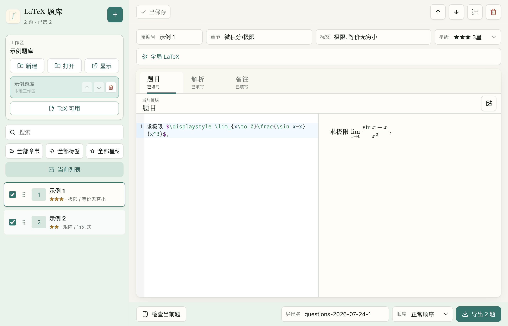

<p align="center">
  
</p>

<h1 align="center">LaTeX 题库</h1>

<p align="center">
  在本地编写、整理、检查并导出 LaTeX 题目。
</p>

<p align="center">
  <a href="README.en.md">English</a>
  ·
  <a href="https://github.com/zyvwang/latex-question-bank/releases">下载预览版</a>
</p>

<p align="center">
  <a href="https://github.com/zyvwang/latex-question-bank/actions/workflows/ci.yml"></a>
  <a href="https://github.com/zyvwang/latex-question-bank/releases"></a>
  <a href="LICENSE"></a>
</p>



LaTeX 题库是一款本地优先的桌面应用。每道题分为题目、解析和备注三个模块，你可以边写边预览公式，用本机 XeLaTeX 检查内容，并将选中的题目整理成 PDF。

题目、图片和导出文件始终保存在你选择的普通文件夹中。应用不要求账户，也不会把题库上传到远端服务。

## 功能

- 使用独立的题目、解析和备注模块编写 LaTeX。
- 通过 MathJax 即时预览公式，插入 PNG 或 JPEG 图片。
- 使用本机 XeLaTeX 检查当前题，编译结果与题目内容绑定。
- 按原编号、章节、标签、星级和关键词整理与筛选题目。
- 勾选题目并拖动排序，或用固定种子生成可复现的随机顺序。
- 导出题目版和完整版的 `.tex` 与 `.pdf` 文件。
- 管理多个本地工作区，通过自动保存、原子写入、备份和历史快照保护内容。

## 环境要求

应用不内置 TeX 发行版。即时预览无需额外安装，编译检查和 PDF 导出需要以下命令：

| 平台 | 推荐发行版 | 所需命令 |
| --- | --- | --- |
| macOS | MacTeX 或 BasicTeX | `latexmk`、`xelatex` |
| Windows | MiKTeX 或 TeX Live | `latexmk.exe`、`xelatex.exe` |
| Linux | TeX Live | `latexmk`、`xelatex` |

安装后可以在终端确认：

```bash
latexmk --version
xelatex --version
```

应用会检查 `PATH` 和常见安装位置。如果 TeX 安装在其他位置，可以在“全局 LaTeX”中填写 `latexmk` 路径。

## 安装

从 [GitHub Releases](https://github.com/zyvwang/latex-question-bank/releases) 下载对应平台的预览版安装包：

- macOS：`.dmg`
- Windows：`.exe`

当前预览版尚未进行 Apple notarization 或 Windows code signing。操作系统可能显示安全警告。

如果 macOS 提示应用已损坏，请先把应用放入 `/Applications`，再运行：

```bash
xattr -dr com.apple.quarantine "/Applications/LaTeX Question Bank.app"
```

## 快速开始

1. 启动应用，选择“新建空白题库”。
2. 选择一个普通文件夹作为工作区。
3. 点击左上角的 `+` 新建题目。
4. 填写原编号、章节、标签和星级。
5. 在题目、解析和备注标签页中编写 LaTeX。
6. 点击“检查当前题”执行真实编译。
7. 勾选需要的题目，设置顺序并导出。

如果想先体验完整内容，可以在首次启动时选择“体验示例题库”。


## 编写 LaTeX

编辑器接收正文片段，不需要完整的文档结构：

```tex
已知函数 $f(x)=x^2$，求 $f'(x)$。
```

行间公式示例：

```tex
\[
\int_0^1 x^2\,dx=\frac{1}{3}.
\]
```

共享宏包和命令放在“全局 LaTeX”中：

```tex
\usepackage{amssymb}
\newcommand{\R}{\mathbb{R}}
```

即时预览适合快速编辑，最终结果以“检查当前题”和导出时的真实 XeLaTeX 编译为准。

## 导出

每次成功导出会在当前工作区生成一个目录：

```text
exports/
└── questions-2026-07-24-1/
    ├── questions.tex
    ├── questions.pdf
    ├── full.tex
    └── full.pdf
```

- `questions.*` 只包含题目。
- `full.*` 包含题目、解析和备注。
- 默认名称使用 `questions-YYYY-MM-DD-N`。
- 正常顺序遵循题目列表，随机顺序可以通过相同种子复现。
- 同名导出会先在临时目录中完成两个 PDF，全部成功后才替换旧结果。

## 工作区与数据

工作区是由你管理的普通文件夹：

```text
workspace/
├── bank.json
├── bank.json.bak
├── assets/
├── exports/
└── .history/
```

- `bank.json` 保存题目、设置和顺序。
- `assets/` 保存插入的图片。
- `exports/` 保存成功导出的文件。
- `bank.json.bak` 和 `.history/` 提供恢复点。

保存请求带有内容 revision。磁盘内容发生变化时，应用会拒绝覆盖并提示冲突。写入使用临时文件和原子替换，应用会话中的首次修改还会创建历史快照。

应用只在本地应用数据中保存最近工作区路径和自定义 TeX 路径。它不提供云同步。如果你通过其他工具同步工作区，请避免在多台设备上同时编辑同一份题库。

## 本地开发

开发环境需要 Node.js 24 和 npm。

```bash
npm install
npm run dev
```

常用验证命令：

```bash
npm run typecheck
npm run lint
npm run test
npm run verify
```

启动 Electron 开发版：

```bash
npm run desktop:dev
```

构建安装包：

```bash
npm run dist:mac
npm run dist:win
```

发布前请按 [发布检查清单](docs/release-checklist.md) 完成验证。

## 技术栈

React 19、Vite、TypeScript、Express、Electron、CodeMirror、MathJax 和 XeLaTeX。

## License

[MIT](LICENSE)
